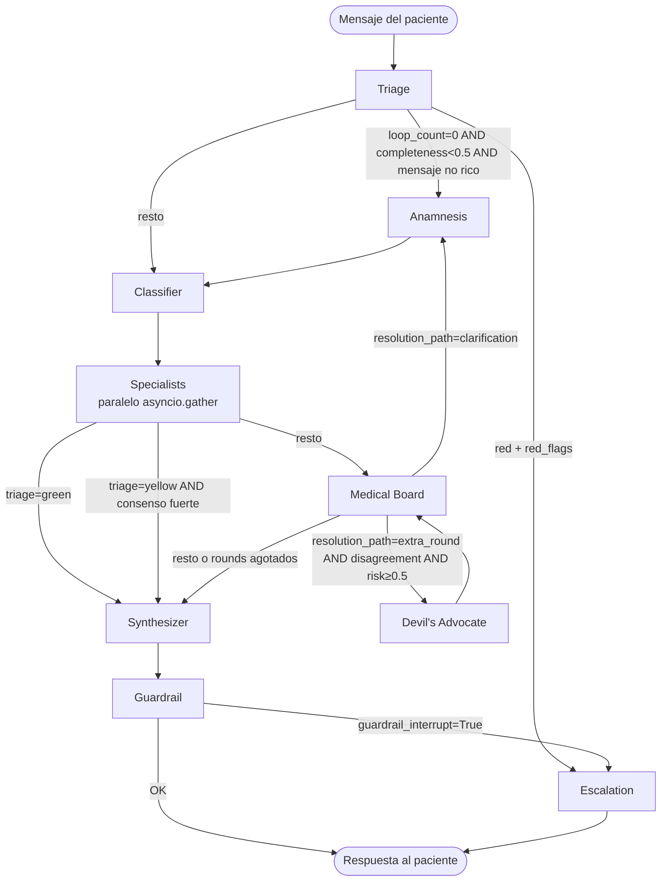

# Flujo Clínico — Grafo LangGraph

Describe el recorrido completo de un mensaje del paciente a través del sistema,
con condiciones de ruteo, bypasses de performance y notas de seguridad.

## Tabla de contenidos

1. [Diagrama del grafo](#diagrama-del-grafo)
2. [Nodos y responsabilidades](#nodos-y-responsabilidades)
3. [Condiciones de ruteo](#condiciones-de-ruteo)
4. [Flujos especiales](#flujos-especiales)
5. [Inyección de contexto pre-grafo](#inyección-de-contexto-pre-grafo)

## Diagrama del grafo

## Nodos y responsabilidades

### Triage
- Modelo: `fast` tier, temperature 0.0
- Pre-filtro determinístico: `red_flag_checker` sobre `data/red_flags.yaml`. Si hay match → RED inmediato sin LLM.
- Pre-filtro de prompt injection: `detect_injection()`. Si hay match → yellow defensivo sin LLM.
- LLM output clampeado: si el LLM dice RED pero no tiene `red_flags_detected` → demote a yellow.
- Fallback: siempre yellow (NUNCA green), confidence 0.3.

### Anamnesis
- Modelo: `fast` tier, temperature 0.3
- Extrae hechos clínicos del mensaje y del historial.
- Puede ser invocado en loop por Medical Board (max 3 veces, `LOOP_CONFIG["max_loops"]`).
- Output: `extracted_facts` (lista de dicts `{key, value}`) y `completeness_score`.

### Classifier
- Modelo: `fast` tier, temperature 0.2
- Mapea síntomas a especialidades usando `data/specialty_map.yaml`.
- Output: `active_specialties` (lista de dicts `{name, weight, reason}`).
- El registry normaliza nombres accentuados/mayúsculas a `snake_case` ASCII.

### Specialists (dispatcher)
- Despacha agents en paralelo via `asyncio.gather`.
- **Tier gating**: si `subscription_tier != "paid"` → skip dispatch, devuelve `tier_gated_specialists=True`.
- Fallback: si ninguna especialidad matchea el registry → `GeneralMedicineAgent`.
- Aliases en registry: `"Traumatología y Ortopedia"` → `traumatologia`, etc.

### Medical Board
- Modelo: `smart` tier, temperature 0.2
- Consolida outputs de specialists, evalúa consenso.
- `resolution_path` puede ser: `synthesis`, `extra_round`, `clarification`.
- Max 2 extra rounds (`MAX_EXTRA_ROUNDS = 2`). Si se supera → fuerza síntesis.

### Devil's Advocate
- Modelo: `fast` tier, temperature 0.5
- Se activa SOLO si: `extra_round` + `disagreement` + `false_consensus_risk ≥ 0.5` + no green.
- Output: `challenges` (lista de dicts con `specialist`, `challenge`, `alternative_hypothesis`).
- Vuelve siempre al Medical Board.

### Synthesizer
- Modelo: `fast` tier, temperature 0.4
- Construye respuesta final del paciente desde triage + specialists + medical board.
- `_clamp_attention`: cap del `attention_level` según triage ceiling (green → "24-48h", yellow → "hoy").
- Si `tier_gated_specialists=True` → agrega `TIER_UPGRADE_HINT` entre respuesta y disclaimer.
- `_compose_patient_text`: sanitiza markdown, concatena disclaimer obligatorio.

### Guardrail
- Modelo: `fast` tier, temperature 0.0
- Solo revisa `synthesized_response` (no outputs internos de specialists).
- `_clamp_interrupt`: solo interrumpe si `severity=critical` + violation type peligroso (`definitive_diagnosis_unsafe`, `prescription_with_dose`, `ignored_red_flag`, `symptom_minimization`, `prompt_injection`).
- Si `interruption_level=MODIFY` → reescribe el texto con la sugerencia del guardrail.
- Fallback: `approve=True + escalation_required=True` (degraded mode, no interrumpe).

### Escalation
- Nodo interno (no LLM).
- Dos paths:
  1. **Emergencia real** (`triage=red` o `red_flags`): mensaje de ER urgente.
  2. **Guardrail interrupt en caso no emergente**: mantiene respuesta existente, ajusta `attention_level` según triage.
- Siempre concatena `BASE_DISCLAIMER`.

## Condiciones de ruteo

| Origen | Destino | Condición |
|--------|---------|-----------|
| Triage | Escalation | `triage_level=red` AND `red_flags` no vacío |
| Triage | Anamnesis | `loop_count=0` AND `completeness_score < 0.5` AND mensaje no rico |
| Triage | Classifier | cualquier otro caso |
| Specialists | Synthesizer | `triage_level=green` |
| Specialists | Synthesizer | `triage_level=yellow` AND ≥2 specialists con mismo top differential AND confidence ≥ 0.8 |
| Specialists | Medical Board | resto |
| Medical Board | Anamnesis | `resolution_path=clarification` |
| Medical Board | Devil's Advocate | `resolution_path=extra_round` AND `consensus_level=disagreement` AND `false_consensus_risk ≥ 0.5` AND `triage != green` |
| Medical Board | Synthesizer | todos los demás casos, o si `debate_rounds > MAX_EXTRA_ROUNDS + 1` |
| Guardrail | Escalation | `guardrail_interrupt=True` |
| Guardrail | END | `guardrail_interrupt=False` |

## Flujos especiales

### Mensaje "rico" (QW3 optimization)
Si el primer mensaje tiene ≥ 200 caracteres Y ≥ 2 keywords clínicas, Triage
saltea Anamnesis directamente a Classifier. Ahorra 3-6s de latencia.
Keywords definidas en `triage/agent.py: _CLINICAL_KEYWORDS`.

### Audit wrapping
Tres nodos tienen audit logging automático (`_audit_node` wrapper):
- `triage` → acción `triage_decision`
- `guardrail` → acción `guardrail_violation`
- `synthesizer` → acción `response_synthesized`

El wrapper usa `asyncio.create_task` para el write (no bloquea el grafo).
Fail-open: si el audit falla, el nodo igual devuelve su resultado.

### `_with_disclaimer` wrapper
Wrappea el Synthesizer. Si la respuesta no contiene `BASE_DISCLAIMER`
(case-insensitive) → lo concatena. Idempotente. Defiende contra LLMs
(ej: Gemini) que parafrasean el disclaimer y omiten el texto canónico.

## Inyección de contexto pre-grafo

Antes de invocar `graph.astream_events()`, el WebSocket endpoint inyecta:

| Campo en state | Fuente | Fallo |
|----------------|--------|-------|
| `messages` | Redis L1 (historial) | array vacío |
| `extracted_facts` | PostgreSQL L2 (pgvector retrieval) | array vacío, no bloquea |
| `patient_timeline` | PostgreSQL L3 | array vacío, no bloquea |
| `patient_profile` | PostgreSQL L3 | dict vacío, no bloquea |
| `kb_context` | pgvector KB retrieval | string vacío, no bloquea |
| `document_context` | Postgres documentos del user | dict vacío, no bloquea |
| `subscription_tier` | `user.subscription_tier` | "free" defensivo |

Todos los L2/L3/KB failures son graceful degradation: el chat sigue funcionando.
