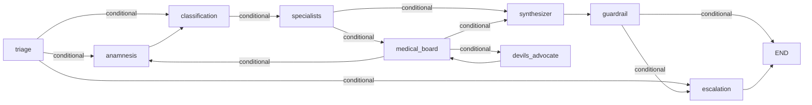

# Orquestación — Grafo LangGraph

Detalle técnico del grafo, el state, y los patrones de construcción.
Para el flujo clínico (qué hace cada nodo), ver
[`../00-product/clinical-flow.md`](../00-product/clinical-flow.md).

## Tabla de contenidos

1. [ClinicalCaseState](#clinicalcasestate)
2. [build_graph()](#build_graph)
3. [Specialist registry](#specialist-registry)
4. [Audit wrappers](#audit-wrappers)
5. [Patrones defensivos](#patrones-defensivos)
6. [Graph cache](#graph-cache)
7. [WebSocket → grafo](#websocket--grafo)

## ClinicalCaseState

TypedDict definido en `orchestrator/state.py`. Todos los nodos reciben
el estado completo y devuelven un **partial dict** (solo los campos que modifican).

Campos clave por dominio:

```python
# Identificación
case_id: str
user_id: str
subscription_tier: Optional[str]   # inyectado por el WS handler

# Triage
triage_level: Optional[Literal["green", "yellow", "red"]]
triage_confidence: float
red_flags: list[str]

# Anamnesis
extracted_facts: list[dict]         # [{key, value}]
completeness_score: float

# Specialists
active_specialties: list[dict]      # [{name, weight, reason}]
specialist_outputs: dict[str, dict] # {specialty: analysis}
tier_gated_specialists: bool

# Mesa Médica
medical_board_result: Optional[dict]
debate_rounds: int
consensus_level: Optional[Literal["full", "partial", "disagreement"]]
challenges: list[dict]
false_consensus_risk: float

# Guardrail
guardrail_violations: list[dict]
guardrail_interrupt: bool

# Output final
synthesized_response: Optional[str]
attention_level: Optional[str]

# Contexto inyectado pre-grafo
messages: list[dict]
document_context: dict
patient_timeline: list[dict]
patient_profile: dict
kb_context: str
```

## build_graph()

`orchestrator/graph.py: build_graph(cred: ProviderCredentialDTO)`

1. Resuelve modelos via `get_chat_model("fast"/"smart", cred, temperature=...)`.
2. Instancia todos los agentes con el modelo resuelto.
3. Construye `StateGraph(ClinicalCaseState)`.
4. Agrega nodos — algunos wrapeados con `_audit_node`.
5. Define edges (condicionados y directos).
6. Retorna `workflow.compile()`.

El grafo compilado se cachea en `graph_cache.py` — `build_graph` se llama
una sola vez por window de 5 min.



## Specialist registry

`agents/specialists/registry.py`:

- **Decorador `@register`**: agrega la clase al dict `REGISTRY` con su
  `specialty_name` normalizado.
- **`_normalize_specialty`**: lowercase + reemplaza espacios/`/`/`-` con `_`
  + NFD decompose + drop combining marks (quita tildes) + colapsa `__`.
- **`ALIASES`**: mapea variantes del classifier a claves canónicas:
  - `traumatologia_y_ortopedia` → `traumatologia`
  - `medicina_familiar` → `medicina_general`
  - `obstetricia` → `ginecologia`
  - `derma` → `dermatologia`
  - `endocrino` → `endocrinologia`

El `__init__.py` de `specialists/` importa todos los módulos para garantizar
que los `@register` se ejecuten antes de cualquier dispatch.

**11 especialidades registradas**:
`cardiology`, `dermatology`, `endocrinology`, `general_medicine`,
`gynecology`, `internal_medicine`, `neurology`, `pediatrics`,
`pharmacology`, `traumatology` (+ `general_medicine` como fallback).

## Audit wrappers

`_audit_node(node, *, action, model_version, build_details)` — wrappea un
nodo para que persista un audit log entry después de ejecutarse.

Patrón clave:
```python
await asyncio.ensure_future(_write_audit())
```

Usa `ensure_future` (no `await directo`) para correr el write como top-level
asyncio Task, fuera del greenlet de LangGraph. Evita
`"another operation is in progress"` de SQLAlchemy cuando el nodo corre
dentro de un greenlet chain del scheduler de LangGraph.

`audit_session` en `graph.py` importa `audit_session` (NullPool) de
`core/database.py`. El NullPool es necesario porque LangGraph interleaves
corrutinas — el pool normal con asyncpg genera `InterfaceError` si una
conexión es reutilizada desde otro greenlet.

## Patrones defensivos

### `_clamp_triage`
Si el LLM dice `red` sin `red_flags_detected` Y sin match determinístico
en el YAML → demote a `yellow`. Evita over-triage por sesgo conservador del LLM.

### `_clamp_attention`
El synthesizer tiende a over-escalar `attention_level` en casos yellow/green.
Triage ceilings:
- `green` → máximo `"24-48h"`
- `yellow` → máximo `"hoy"`

### `_clamp_interrupt`
El guardrail solo interrumpe si hay `severity=critical` + violation type en
`_INTERRUPT_WORTHY_VIOLATIONS`. Sin esto, emitía `INTERRUPT` en texto clínico
benigno → 8/9 fallos en la eval baseline.

### `_with_disclaimer`
Wrapper idempotente sobre Synthesizer que garantiza `BASE_DISCLAIMER` en la
respuesta. Gemini parafrasea el disclaimer → el check case-insensitive lo detecta
y lo concatena igualmente.

## Graph cache

`core/graph_cache.py: get_or_build_graph(user_id)`

- Dict in-memory: `user_id → (graph, timestamp)`.
- `asyncio.Lock` per-entry para evitar race conditions en el mismo worker.
- TTL: 5 minutos. Después → rebuild con credencial activa del vault.
- **Limitación**: in-memory, por worker. Multi-worker = cada proceso tiene
  su cache. Si se rota la credencial LLM, los workers que no hayan expirado
  el cache siguen con el grafo viejo hasta que TTL expire.

## WebSocket → grafo

Flujo en `api/v1/chat.py`:

```python
# 1. Construir state inicial
state = create_initial_state(case_id, user_id, content)
state["messages"] = await load_messages(user_id, case_id)  # L1
state["subscription_tier"] = user.subscription_tier

# 2. Inyectar contexto L2/L3/KB (graceful degradation)
state["extracted_facts"] = ...   # L2 pgvector
state["patient_timeline"] = ...  # L3
state["patient_profile"] = ...   # L3
state["kb_context"] = ...        # KB
state["document_context"] = ...  # si el mensaje referencia docs

# 3. Correr grafo con streaming
async for event in graph.astream_events(state, config, version="v2"):
    await _handle_event(websocket, event, case_id)
    # capturar response_text de synthesizer/guardrail/escalation

# 4. Emitir done frame post-guardrail
await websocket.send_json({"type": "done", "response": response_text, "case_id": case_id})

# 5. Persistir memoria
await append_messages(user_id, case_id, content, response_text)  # L1
await store_timeline_event(...)  # L3
await store_facts(...)           # L2
```

`GRAPH_TIMEOUT = 120s` — si el grafo tarda más, cierra la conexión con 1011.
