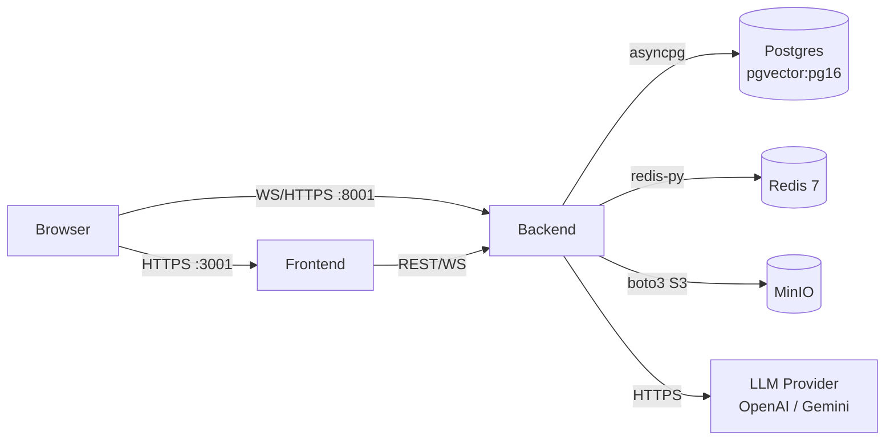

# Stack Tecnológico

Versiones exactas verificadas en los manifests del repo (2026-05-01).

## Tabla de contenidos

1. [Backend](#backend)
2. [Frontend](#frontend)
3. [Infraestructura](#infraestructura)
4. [Diagrama de servicios](#diagrama-de-servicios)

## Backend

| Tecnología | Versión | Rol |
|-----------|---------|-----|
| Python | 3.12 | Runtime |
| FastAPI | (ver pyproject.toml) | Framework HTTP + WebSocket |
| SQLAlchemy | 2.x | ORM async (`asyncpg`) |
| asyncpg | — | Driver PostgreSQL async |
| PyJWT | — | Firma y validación de JWT |
| LangGraph | — | Orquestación del grafo multi-agente |
| LangChain OpenAI | — | Adapter LLM (`ChatOpenAI`) |
| Redis | 7 (alpine) | Memoria L1 + rate limit WebSocket |
| PostgreSQL | 16 + pgvector | DB principal + embeddings L2/KB |
| MinIO | latest | Object storage (documentos S3-compatible) |
| slowapi | — | Rate limiting HTTP (in-process, single-worker) |
| Alembic | — | Migraciones de schema |
| Poetry | — | Gestión de dependencias |

### Modelos LLM

El sistema tiene dos tiers de modelo, resueltos por el LLM Router al
construir el grafo:

| Tier | Uso | Notas |
|------|-----|-------|
| `fast` | Triage, Anamnesis, Classifier, Specialists, Devil's Advocate, Guardrail, Synthesizer | Alto throughput, menor latencia |
| `smart` | Medical Board | Razonamiento profundo, mayor latencia |

El modelo concreto depende de la credencial activa en el vault (OpenAI GPT-4o /
GPT-4o-mini, Gemini con compat OpenAI, etc.). No hay hardcodeo de nombre de
modelo en el grafo excepto en los audit model_version strings.

## Frontend

| Tecnología | Versión | Rol |
|-----------|---------|-----|
| Next.js | 16.2.3 | Framework React fullstack |
| React | 19.2.4 | UI |
| TypeScript | 5.x | Tipado |
| Tailwind CSS | 4.x | Styling (utility-first) |
| shadcn/ui | 4.2.0 | Componentes (con `@base-ui/react`, NO Radix) |
| `@base-ui/react` | 1.3.0 | Primitivas base de shadcn v4 |
| zustand | 5.0.12 | Estado global (auth store) |
| lucide-react | 1.8.0 | Iconos |
| sonner | 2.0.7 | Toast notifications |
| Vitest | 4.1.5 | Test runner |
| React Testing Library | 16.3.2 | Tests de componentes |
| jsdom | 29.1.1 | DOM simulado en tests |

### Fuentes tipográficas

Cargadas via `next/font/google` en `src/app/layout.tsx`:

| Variable CSS | Fuente | Notas |
|-------------|--------|-------|
| `--font-geist` | Geist | Variable font |
| `--font-geist-mono` | Geist Mono | Variable font |
| `--font-instrument-serif` | Instrument Serif | NO variable — requiere `weight: "400"` y `style: ["normal", "italic"]` |

## Infraestructura

Orquestada con Docker Compose (`infra/docker/docker-compose.yml`):

| Servicio | Imagen | Puerto host |
|----------|--------|------------|
| backend | `tuki-medic-backend:latest` | 8001 → 8000 |
| frontend | `tuki-medic-frontend:latest` | 3001 → 3000 |
| postgres | `pgvector/pgvector:pg16` | — (interno) |
| redis | `redis:7-alpine` | — (interno) |
| minio | `minio/minio:latest` | 9000, 9001 (console) |

`ENVIRONMENT=development` en el container backend.

## Diagrama de servicios

Los healthchecks de Docker Compose garantizan que `postgres`, `redis` y
`minio` estén `healthy` antes de arrancar `backend`.
